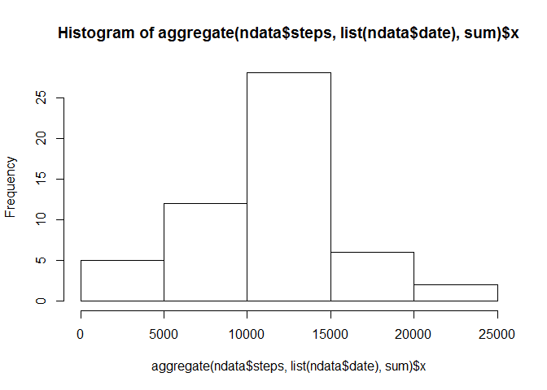
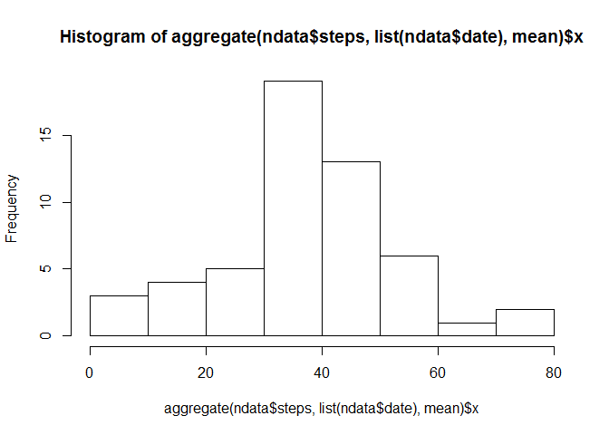
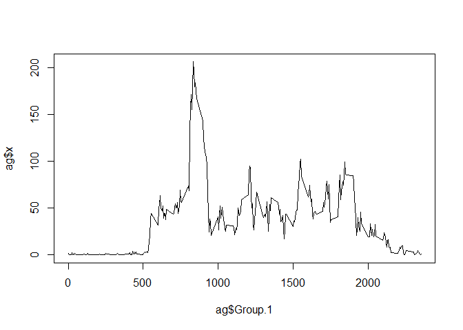
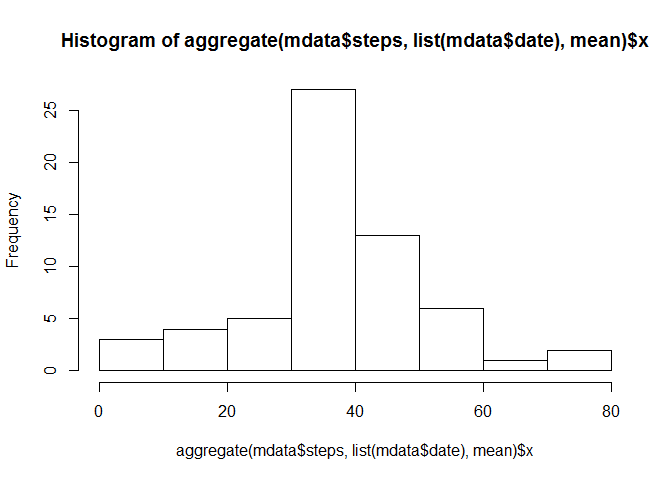
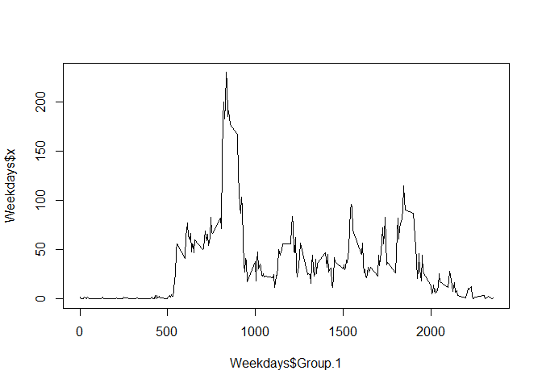
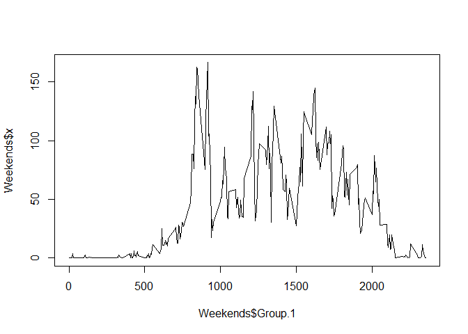

# Reproducible Research: Peer Assessment 1


## Loading and preprocessing the data

```r
filename <- "activity.zip"
if (!file.exists(filename)){
  URL <- "https://d396qusza40orc.cloudfront.net/repdata%2Fdata%2Factivity.zip"
  download.file(URL, filename)
}
if(!file.exists("activity.csv")){
  unzip(filename)
}
data <- read.csv("activity.csv")
ndata <- data[complete.cases(data),]
```


## What is mean total number of steps taken per day?

### Sum

```r
hist(aggregate(ndata$steps, list(ndata$date), sum)$x)
```

<!-- -->

### Mean 

```r
hist(aggregate(ndata$steps, list(ndata$date), mean)$x)
```

<!-- -->

### Median

```r
aggregate(ndata$steps, list(ndata$date), median)$x
```

```
##  [1] 0 0 0 0 0 0 0 0 0 0 0 0 0 0 0 0 0 0 0 0 0 0 0 0 0 0 0 0 0 0 0 0 0 0 0
## [36] 0 0 0 0 0 0 0 0 0 0 0 0 0 0 0 0 0 0
```

## What is the average daily activity pattern?


```r
ag <- aggregate(ndata$steps, list(ndata$interval), mean)
plot(ag$Group.1, ag$x, type="l")
```

<!-- -->

Largest average interval is interval 835

## Imputing missing values

Number of NA's = 2304

#### Replace NA's with the average for the 5 minute interval they were taken in (rounded to the nearest int)

```r
mdata <- merge(data, ag, by.x = "interval", by.y = "Group.1")
mdata$steps[is.na(mdata$steps)] <- round(mdata$x[is.na(mdata$steps)])
```


### Sum w/o NA's

```r
hist(aggregate(mdata$steps, list(mdata$date), sum)$x)
```

<!-- -->

### Mean w/o NA's

```r
hist(aggregate(mdata$steps, list(mdata$date), mean)$x)
```

<!-- -->

### Median w/o NA's

```r
aggregate(mdata$steps, list(mdata$date), median)$x
```

```
##  [1] 34.5  0.0  0.0  0.0  0.0  0.0  0.0 34.5  0.0  0.0  0.0  0.0  0.0  0.0
## [15]  0.0  0.0  0.0  0.0  0.0  0.0  0.0  0.0  0.0  0.0  0.0  0.0  0.0  0.0
## [29]  0.0  0.0  0.0 34.5  0.0  0.0 34.5  0.0  0.0  0.0  0.0 34.5 34.5  0.0
## [43]  0.0  0.0 34.5  0.0  0.0  0.0  0.0  0.0  0.0  0.0  0.0  0.0  0.0  0.0
## [57]  0.0  0.0  0.0  0.0 34.5
```

## Are there differences in activity patterns between weekdays and weekends?


```r
daytype = function(x){
        if(x %in% c('Saturday', 'Sunday')){
                return('Weekend')
        }

        return('Weekday')
}

mdata$dayname = weekdays(as.Date(mdata$date))
mdata$daytype = as.factor(apply(as.matrix(mdata$dayname), 1, daytype))
wdata <- mdata[mdata$daytype == "Weekday",]
wedata <- mdata[mdata$daytype == "Weekend",]
Weekdays <- aggregate(wdata$steps, list(wdata$interval), mean)
Weekends <- aggregate(wedata$steps, list(wedata$interval), mean)
plot(Weekdays$Group.1, Weekdays$x, type="l")
```

<!-- -->

```r
plot(Weekends$Group.1, Weekends$x, type="l")
```

<!-- -->
